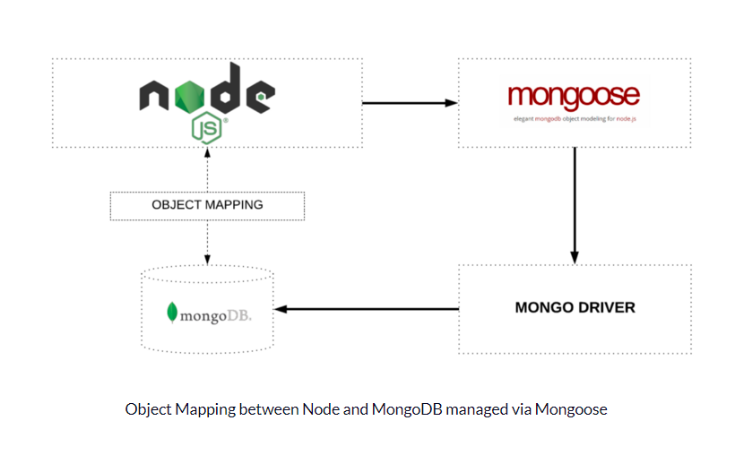

# Data Modeling & NoSQL Databases :fire:

## Reading, Research, and Discussion :mag_right:

1. Why would a developer choose to make **data models**?
2. What purpose do **CRUD** operations serve?
3. What kind of database is **Postgres**? What kind of database is MongoDB?
4. What is **Mongoose** and why do we need it?
5. Define three related pieces of data in a possible application. An example for a store application might be Product, Category and Department. Describe the constraints and rules on each piece of data and how you would relate these pieces to each other. For example, each Product has a Category and belongs in a Department.

**Data models** define how the logical structure of a database is modeled. Data Models are **fundamental entities** to introduce abstraction in a DBMS. Data models define how data is `connected` to each other and how they are processed and stored inside the system.

The main **highlights** of this model are : :high_brightness:

- Data is stored in tables called **relations**.
- Relations can be **normalized**.
- In normalized relations, values saved are atomic values.
- Each row in a relation contains a **unique value**.
- Each column in a relation contains values from a same domain.

Why would a developer choose to make use **data modeling**? :relieved:

- To assist business analysts, programmers, testers, manual writers, IT package selectors, engineers, managers, related organizations and clients to understand and use an agreed semi-formal model the concepts of the organization and how they relate to one another.
- To manage data as a resource.
- For the integration of information systems.
- For designing databases/data warehouses (aka data repositories).

#### CRUD :cloud:

The acronym **CRUD** refers to all of the major functions that are implemented in **relational database** applications. Each letter in the acronym can map to a standard operation:
| Operation | SQL | HTTP | RESTful WS | DDS | MongoDB |
| ----------- | ------ | ----- | ------- | --------- | ---------- |
| **C**reate | INSERT | PUT / POST | POST | write | Insert |
| **R**ead (Retrieve) | SELECT | GET | GET | read / take | Find |
| **U**pdate (Modify) | UPDATE | PUT / POST / PATCH | PUT |write | Update |
| **D**elete (Destroy) | DELETE | DELETE | DELETE | dispose | Remove |

**CRUD operations** in RDBMS are the basic operation units, built upon which is a **very rich ecosystem**, such as _security control_, object _permission/access_, _locking mechanism_, _performance optimization_, _transaction control_, _resource control_, etc.

#### Postgres &amp; MongoDB :package:

**PostgreSQL** is a general purpose and **object-relational database management system**, the most advanced open source database system. PostgreSQL was developed based on POSTGRES 4.2.
PostgreSQL is free and **open source software**. Its source code is available under PostgreSQL license, a liberal open source license. You are free to use, modify and distribute PostgreSQL in any form.

**MongoDB** is a cross-platform **document-oriented database program**. Classified as a **NoSQL** database program, MongoDB uses JSON-like documents with schema. MongoDB is developed by MongoDB Inc. and licensed under the Server Side Public License (SSPL).

#### Mongoose 

**Mongoose** is an **Object Data Modeling (ODM) library** for MongoDB and Node.js. It manages relationships between data, provides schema validation, and is used to translate between objects in code and the representation of those objects in MongoDB.

The `require(‘mongoose’)` call returns a **Singleton object**. It means that the first time you call `require(‘mongoose’)`, it is creating an instance of the Mongoose class and returning it.

**Using Mongoose** will make the **transition** into a NoSQL environment much easier. It will also **save you time** writing your own **validations** and instance methods and is highly recommended for smaller DBs and basic Mongo operations

### Additional Resources :pager:

**Cloud Databases**
There are a few alternatives to running **Mongo** locally for your web servers

- [MLab](https://www.mlab.com/) - remotely hosted mongoDB systems. Easily setup a free database (or pay for more horsepower). Works great with Heroku
- [Atlas](https://www.mongodb.com/cloud/atlas) - Cloud based, highly scalable Mongo DB
- [DynamoDB](https://aws.amazon.com/dynamodb/) - AWS NoSQL Database. Very highly scalable. Also provides a ‘mongoose’-like ORM called ‘dynamoose’
- [CosmosDB](https://cosmos.azure.com/) - The Microsoft Azure equivalent for Atlas and Dynamo

**Videos** :smirk:

- [sql vs nosql](https://www.youtube.com/watch?v=ZS_kXvOeQ5Y)

**Bookmark / Skim** :star:

- [nosql vs sql](https://www.thegeekstuff.com/2014/01/sql-vs-nosql-db/?utm_source=tuicool)
- [nosql modeling techniques](https://highlyscalable.wordpress.com/2012/03/01/nosql-data-modeling-techniques/)
- [mongoose api](https://mongoosejs.com/docs/api.html#Model)

### Document the following Vocabulary Terms :memo:

| Term                            | Documentation                                                                                                                                                                                                                                               |
| ------------------------------- | ----------------------------------------------------------------------------------------------------------------------------------------------------------------------------------------------------------------------------------------------------------- |
| database                        | is a data structure that stores organized information                                                                                                                                                                                                       |
| data model                      | the process of documenting a complex software system design as an easily understood diagram, using text and symbols to represent the way data needs to flow.                                                                                                |
| CRUD                            | create, read, update, and delete (CRUD) are the four basic functions of persistent storage                                                                                                                                                                  |
| schema                          | the organization or structure for a database                                                                                                                                                                                                                |
| sanitize                        | checking user input before storing it in a database or using it for any other purpose to prevent malicious code injection.                                                                                                                                  |
| Structured Query Language (SQL) | a programming nomenclature used to do set operations (like union, intersect, and minus) to organize and retrieve information in relational databases, based on “set theory and relational algebra.”                                                         |
| Non SQL (NoSQL)                 | database provides a mechanism for storage and retrieval of data that is modeled in means other than the tabular relations used in relational databases                                                                                                      |
| MongoDB                         | a cross-platform document-oriented database program. Classified as a NoSQL database program, MongoDB uses JSON-like documents with schema.                                                                                                                  |
| Mongoose                        | an Object Document Mapper (ODM). This means that Mongoose allows you to define objects with a strongly-typed schema that is mapped to a MongoDB document. Mongoose provides an incredible amount of functionality around creating and working with schemas. |
| record                          | a collection of fields, possibly of different data types, typically in fixed number and sequence.                                                                                                                                                           |
| document                        | a piece of written, printed, or electronic matter that provides information or evidence or that serves as an official record.                                                                                                                               |
| Object Relation Mapping (ORM)   | a programming technique in which a metadata descriptor is used to connect object code to a relational database. Object code is written in object-oriented programming (OOP) languages such as Java or C#.                                                   |