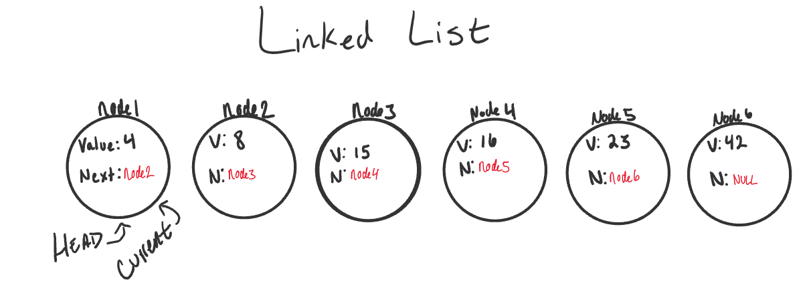

# Linked Lists :boom:

**Resources** :partly_sunny:

1. Read: [Linked Lists](https://codefellows.github.io/common_curriculum/data_structures_and_algorithms/Code_401/class-05/resources/singly_linked_list.html)
1. Read: [What’s a Linked List, Anyway pt1](https://medium.com/basecs/whats-a-linked-list-anyway-part-1-d8b7e6508b9d)
1. Read: [What’s a Linked List, Anyway pt2](https://medium.com/basecs/whats-a-linked-list-anyway-part-2-131d96f71996)

### Q1:What is a Linked List :interrobang:

1. is a **sequence** of **Nodes** that are **connected/linked to each other**. The most defining feature of a Linked List is => that **each Node references the next Node in the link**.
1. A data structure that contains nodes that links/points to the next node in the list.

There are **two types of Linked List**

1.  **Singly** (will be used)
    - refers to the **number of references the node has.**
    - means that there is **only one reference**, and the reference points to the **Next** node in a linked list.
1.  **Doubly**
    - refers to there being **two (double) references within the node.**
    - means that there is a reference to both the **Next** and **Previous** node.

#### Extra INFORMATION :link:

1. **Node**
   - Nodes are the **individual** items/links that **live in a linked list**.
   - Each node **contains** the **data** for each link.
1. **Next**
   - Each node contains a **property** called Next.
   - This property **contains** the **reference** to the **next** node.
1. **Head**
   - The Head is a **reference type of type Node** to the **first** node in a linked list.
1. **Current**
   - The Current reference is a **reference type of type Node** that is **currently being looked at**.
   - This node is **traditionally** used when **traversing** through a full linked list.
   - When **traversing**, you typically **reset** the **current** to the **head** to **guarantee you are starting from the beginning of the linked list.**



## Traversal :white_square_button:

1. When **traversing** a linked list, you are **not** **able to use a foreach or for loop**.
1. We **depend on the Next value** in each **node** to **guide us** **where** the **next reference is pointing**.
   - The **Next property** is **exceptionally important** because =>
     - **lead** us **where** the next node is
     - **allow** us to **extract** the data **appropriately**.

`The best way to approach a traversal is through the use of a while() loop.`
`NullReferenceException gets thrown and our program will crash/end.`

1. When traversing through a linked list, the **Current node is the most helpful:**.
   - The Current **will tell us where exactly in the linked list we are**
   - will **allow us to move/traverse forward until we hit the end**.

#### Example

**The pseudo-code for an Includes is as so:**

```
		ALGORTIHM Includes (value)
		// INPUT <-- integer value
		// OUTPUT <-- boolean

			Current <-- Head

			WHILE Current is not NULL
				IF Current.Value is equal to value
					return TRUE

				Current <-- Current.Next

			return FALSE
```