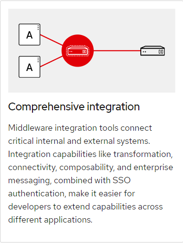
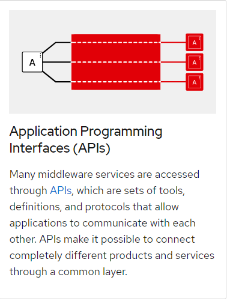

# Express :outbox_tray:

## Express Routing :traffic_light:

1. **Event driven** system:

- `app.get('/thing', (req,res) => {})`
- This is the same **pattern** we see in **Vanilla JS**, **jQuery**

1. The **Request** Object:

- `(req,..)`
- /:parameters like >> `req.params.thing`

1. **Query Strings**:

- `http://server/route?ball=round` = `req.query.ball`

1. The **Response** Object:

- `(..., res)`
- Responsible for sending data back to the browser.
- Has methods like `send()` and `status()` that Express uses to format the output to the browser properly.

## Express Middleware :stars:

**Middleware function**s are functions that have **access** to the **request object** `(req)`, the r**esponse object** `(res)`, and the next middleware function in the application’s **request-response cycle**. The next middleware function is commonly **denoted by a variable named next**.

Middleware functions can perform the following **tasks**: :memo:

- Execute any code.
- Make changes to the request and the response objects.
- End the request-response cycle.
- Call the next middleware function in the stack.

Each function receives `request`, `response` and next **as parameters**
|  |  |
| ---------------------------- | ----------------------- |
|  |  |
