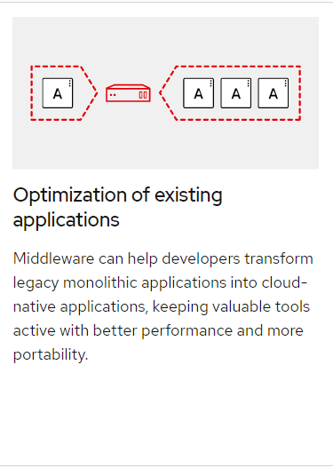

# Express :outbox_tray:

## Express Routing :traffic_light:

1. **Event driven** system:

- `app.get('/thing', (req,res) => {})`
- This is the same **pattern** we see in **Vanilla JS**, **jQuery**

1. The **Request** Object:

- `(req,..)`
- /:parameters like >> `req.params.thing`

1. **Query Strings**:

- `http://server/route?ball=round` = `req.query.ball`

1. The **Response** Object:

- `(..., res)`
- Responsible for sending data back to the browser.
- Has methods like `send()` and `status()` that Express uses to format the output to the browser properly.

## Express Middleware :stars:

**Middleware function**s are functions that have **access** to the **request object** `(req)`, the r**esponse object** `(res)`, and the next middleware function in the application’s **request-response cycle**. The next middleware function is commonly **denoted by a variable named next**.

Middleware functions can perform the following **tasks**: :memo:

- Execute any code.
- Make changes to the request and the response objects.
- End the request-response cycle.
- Call the next middleware function in the stack.

Each function receives `request`, `response` and next **as parameters**
|  |  |
| ---------------------------- | ----------------------- |
|  |  |

The following table shows overview of the **Rest APIs** that will be **exported**:

| Methods | Urls                     | Actions                                      |
| ------- | ------------------------ | -------------------------------------------- |
| GET     | api/tutorials            | get all Tutorialsn                           |
| GET     | api/tutorials/:id        | get Tutorial by id                           |
| POST    | api/tutorials            | add new Tutorial                             |
| PUT     | api/tutorials/:id        | update Tutorial by id                        |
| DELETE  | api/tutorials/:id        | remove Tutorial by id                        |
| DELETE  | api/tutorials            | remove all Tutorials                         |
| GET     | api/tutorials/published  | find all published Tutorials                 |
| GET     | api/tutorials?title=[kw] | find all Tutorials which title contains 'kw' |

## What is Server Testing? :white_check_mark:

**Server testing** verifies that the services you need to develop your apps are working as intended. A testing suite includes a number of test cases that demonstrate not only what is working correctly, but what works when it shouldn’t.

## TestPyramid :small_red_triangle:

The test pyramid is a way of thinking about how different kinds of automated tests should be used to create a balanced portfolio.
 

 **Additional Resources** :partly_sunny:

1. Videos: [express middleware explained](https://www.youtube.com/watch?v=9HOem0amlyg)

**Bookmark / Skim** :star:

- [using express middleware](https://expressjs.com/en/guide/using-middleware.html)
- [express middleware](https://www.tutorialspoint.com/expressjs/expressjs_middleware.htm)
- [using express routing;](https://expressjs.com/en/guide/routing.html)
- [supertest](https://github.com/visionmedia/supertest)
- [express middleware list](https://expressjs.com/en/resources/middleware.html)
- [http status codes](https://www.restapitutorial.com/httpstatuscodes.html)

