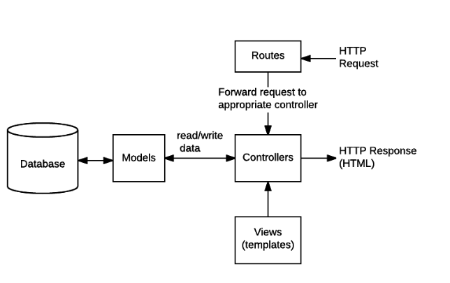
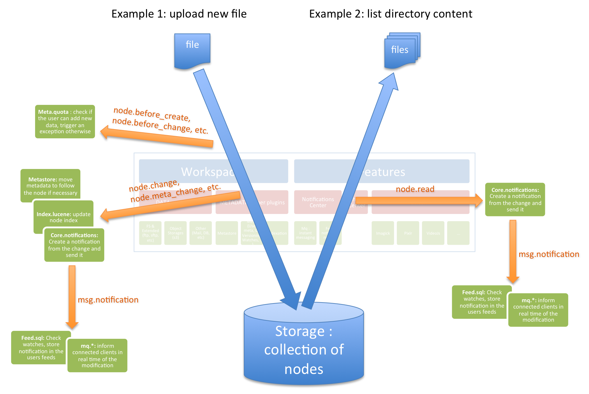

# Event Driven Applications :game_die:

## Event Driven Programming :computer:

In computer programming, **event-driven programming** is a programming **paradigm** in which the **flow of the program is determined by events** such as user actions (mouse clicks, key presses), sensor outputs, or messages from other programs or threads. It's the **dominant** paradigm used in graphical user interfaces and other applications like *JavaScript* web applications, that are centered on performing certain actions in **response to user input**. 
In an event-driven application, there is generally a **main loop** that listens for events, and then **triggers** a callback function when one of those events is detected.
The main body of the program is an event loop.
Abstractly:
```
do {
e = getNextEvent();
process event e;
} while (e != quit);
```

**Most actions in JS are event driven**: :bomb:
- **UI events**:
All **UI** actions happen in the UI thread – **even when** they execute callbacks to code like `actionListener`. If the event handler does a lot of computing, the user interface will **appear to freeze up**.
- **Express Routes** :

example for node server code :
`express-server.js`
```
let SQL = "DELETE FROM sometable WHERE id = $1"
let values = [request.query.id];
client.query(SQL, values)
  .then( results => {
    emit('delete', request.query.id);
    res.send('Record Deleted')
  });
```
`some-other-module.js`
```
// Whenever the "delete" event has been emitted anywhere in my code base
// Run this function
events.on('delete', (data) => {
    sendEmail({
        to: 'admin@here.com',
        subject: 'Someone deleted part of the database',
        body: `Record id: ${data} was removed`
    });
});
```
- **Hooks: event-driven model**:
Example of hooks triggered during the life of a node when a file is uploaded (node1) or when listing a directory content (node 2):



**Additional Resources** :partly_sunny:

**Bookmark / Skim** :star:

- [Event Driven Programming](https://alligator.io/nodejs/event-driven-programming/)
- [Node docs: events](https://nodejs.org/api/events.html)
