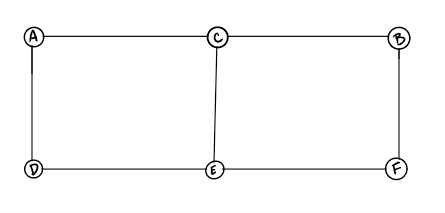
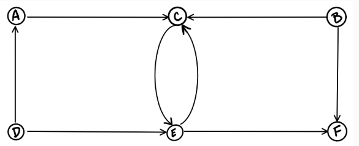
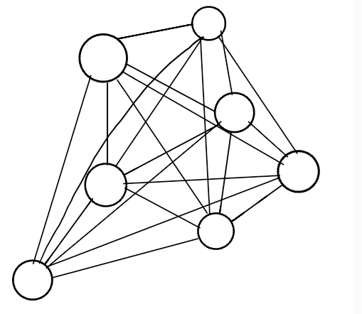
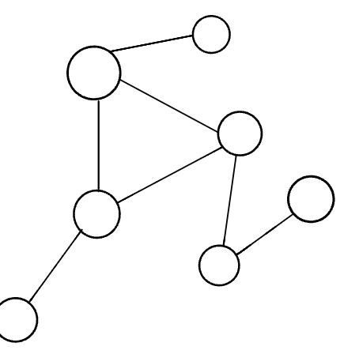
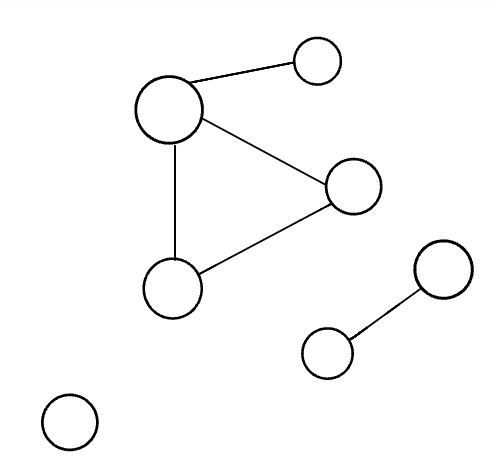
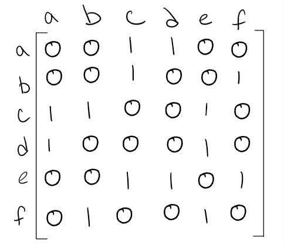
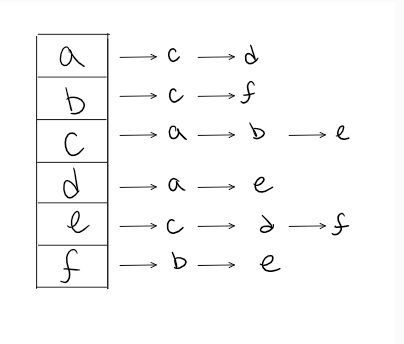

# Graphs

A **graph** is a `non-linear` data structure that can be looked at as a collection of vertices (or nodes) potentially connected by line segments named edges.

#### terminology used with Graphs:
- **Vertex** , also called a **“node”**, is a data object that can have zero or more adjacent vertices.
- **Edge** is a `connection` between two nodes.
- **Neighbor** , The neighbors of a node are its **adjacent nodes**.
- **Degree**, The degree of a vertex is the **number** of edges connected to that vertex.

## Directed vs Undirected

#### Undirected Graphs:
An `Undirected Graph` is a graph where each **edge is undirected or bi-directional**. This means that the undirected graph does not move in any direction.

In this example `Node C` is connected to `Node A`, `Node E` and `Node B`. There are no **“directions”** given to point to specific vertices.

#### Directed Graphs (Digraph):
A `Directed Graph` also called a `Digraph` is a graph where **every edge is directed**.
Digraph **has direction**. Each node is directed at another node with a specific requirement of what node should be **referenced next**.

| Complete Graphs | Connected | Disconnected |
| --------------- | --------- | ------------ |
|  |   |  |

##### Acyclic Graph:
**Directed** graph **without cycles**.

##### Cyclic Graphs:
A Cyclic graph is a graph that **has cycles**.

## Graph Representation:
- Adjacency **Matrix**
- Adjacency **List**

An **Adjacency matrix** is represented through a **2-dimensional array**. If there are `n` vertices, then we are looking at an `n x n` Boolean **matrix**.
An **adjacency list** is a collection of **linked lists** or array that lists all of the other vertices that are connected.

 

## Weighted Graphs:
it's graph with **numbers** assigned to its edges. These numbers are called **weights**.

 **Resources** :partly_sunny:

**Read** :star:

- [Graphs](https://codefellows.github.io/common_curriculum/data_structures_and_algorithms/Code_401/class-35/resources/graphs.html)

